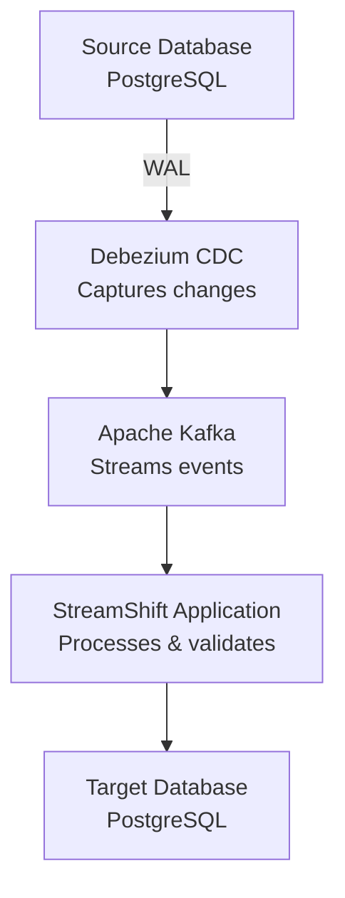

# StreamShift

A zero-downtime database migration tool using Change Data Capture (CDC) to stream real-time data changes from source to target databases through Apache Kafka.

## Overview

StreamShift enables seamless database migrations without taking your applications offline. By leveraging Debezium CDC and Kafka streaming, it captures every INSERT, UPDATE, and DELETE operation from your source database and applies them to your target database in real-time.

## Technologies 

PostgreSQL (Source/Target): The database being migrated and the final synchronized target. The Source DB is configured for logical replication, allowing changes to be tracked.

Debezium CDC: This connector monitors the PostgreSQL Write-Ahead Log (WAL) to capture all row-level changes (INSERTs, UPDATEs, DELETEs) as structured change events.

Apache Kafka: Serves as a reliable, durable, and highly scalable message queue, transporting the change events from Debezium to the StreamShift application.

StreamShift Application (Spring Boot): The core consumer. It reads events from Kafka, parses the CDC payload, and applies the changes to the Target DB using an idempotent UPSERT strategy to ensure data consistency and prevent primary key conflicts.

## Architecture

## Local Development Quick Start 

If you need to adjust the database or initial data, edit scripts/postgres-source-init.sql

Start all containers and register the Debezium connector using ./scripts/setup-postgres.sh start

Start the application with mvn spring-boot:run

Test Change Data Capture by executing SQL commands against the source database and observe the change event in the consumer logs

To stop and remove containers and volumes, run docker-compose down -v

